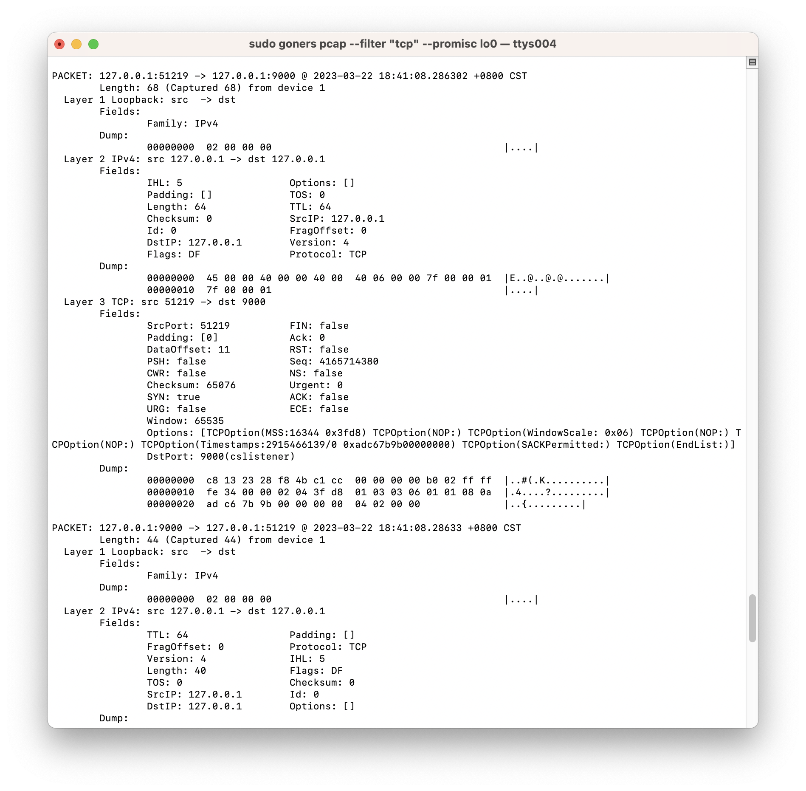
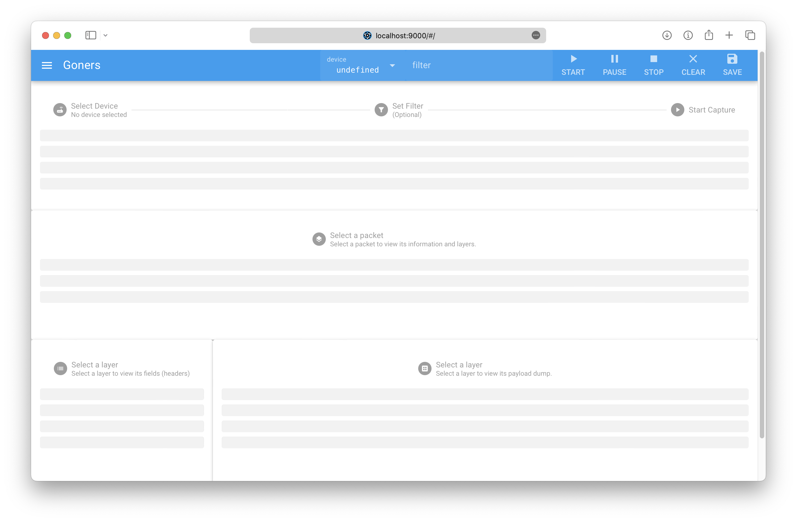
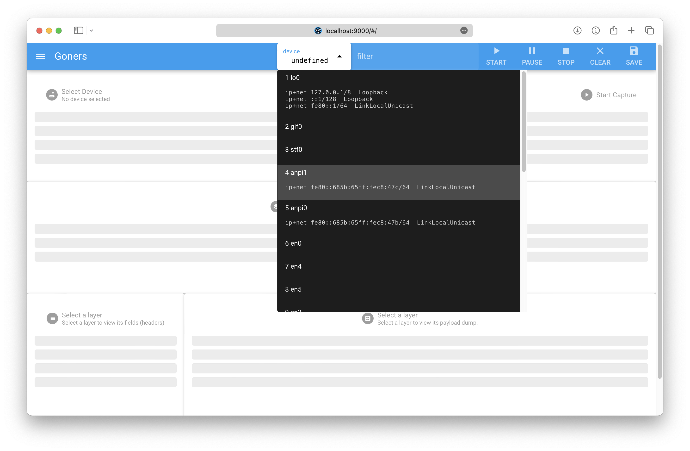
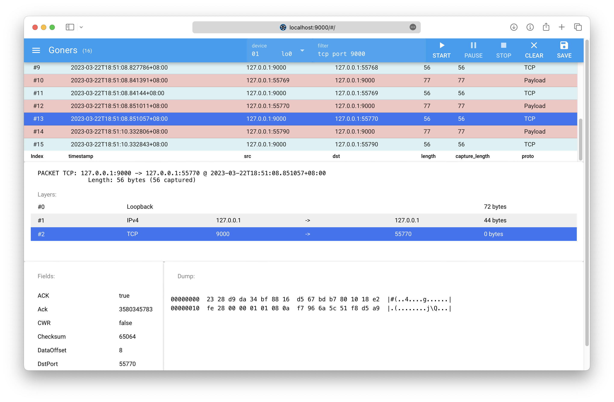

# goners

> Goner's Oafish Network Explorer & Reliable Sniffer.

`goners` 是一个可拓展的、模块化设计的网络嗅探器。`goners` 后端基于 Go 语言实现，前端使用 Vue 3 （Quasar）构建。“goners”一词是“Goner's Oafish Network Explorer & Reliable Sniffer”的递归缩写。

`goners` 提供如下特性：

- 基础网络抓包、分析功能
  - 基于 libpcap 的网络数据包抓取
  - 基于 GoPacket 的数据包解析
    - 支持主流数据链路层、网络层、传输层协议（详见后文[协议支持](#协议支持)一节）
  - 支持 BPF 过滤器
    - 语法参考：https://biot.com/capstats/bpf.html
    - 通过设置适当的过滤规则，可以有一定的流追踪能力（例如：`ip host 127.0.0.1 and tcp port 9000` 可以追踪对应 IP + Port 的 TCP 流）
- 用户界面：
  - CLI：类似于 tcpdump，提供更简单易用的接口。
  - WebUI：类似于 Wireshark 的图形化界面。
  - CLI + WebUI 以 C/S（B/S）模式工作，提供远程抓包的能力（暂不安全，不推荐使用）。
  - 也可以作为库（golang package）在其他程序中调用。
- 输出方式：
  - 文件（包括 stdout）
  - WebSocket
  - ……（可拓展）
- 输出格式：
  - 为人类阅读优化的纯文本
  - 为机器解析设计的 JSON 格式
  - ……（可拓展）
- 插件式的拓展包分析支持（WIP）: https://pkg.go.dev/github.com/google/gopacket#hdr-Implementing_Your_Own_Decoder
- 安全 HTTP、WebSocket 以及远程调用认证机制（WIP）

## Install

```sh
git clone https://github.com/cdfmlr/goners.git
cd goners

# 后端
cd goners
sudo go run ./cmd -h
# or `go build` for production

# 前端
cd webui
pnpm install
pnpm quasar dev
# or `quasar build` for production
```

## Usage

Goners 是一款网络探测和数据嗅探工具，其能够帮助用户查找网络接口设备、捕获网络数据包并提供 HTTP API 服务。该工具支持多种数据格式输出，包括文本和 JSON 格式。

Goners 主要包括三个命令：`devices`、`pcap` 和 `http`。

```sh
NAME:
   goners - goner's oafish network explorer & reliable sniffer

USAGE:
   goners [global options] command [command options] [arguments...]

COMMANDS:
   devices  Look up network interfaces (i.e. devices)
   pcap     Capture live packets from device. Root privilege is required.
   http     Listen and serve goners api service on HTTP.
   help, h  Shows a list of commands or help for one command

GLOBAL OPTIONS:
   --help, -h  show help
```

### devices

`devices` 子命令用于查找可用的网络接口设备。用户可以选择输出格式，支持文本格式和 JSON 格式。

```sh
NAME:
   goners devices - Look up network interfaces (i.e. devices)

USAGE:
   goners devices [command options] [arguments...]

OPTIONS:
   --format FORMAT  Output FORMAT: text | json
                    text: our human preferred text.
                    json: the JSON format (more readable for machines)
       (default: "text")
   --help, -h  show help
```

类似于不带参数的 `ifconfig`，获取网络接口信息。

e.g.

```sh
$ goners devices
(1) lo0: 
	ip+net 127.0.0.1 (prefixlen 8) Loopback
	ip+net ::1 (prefixlen 128) Loopback
	ip+net fe80::1 (prefixlen 64) LinkLocalUnicast
(2) gif0: 
(3) stf0: 
(11) en0: cd:fm:lr:20:23:03
	ip+net fe80::3141:1592:6535:5897 (prefixlen 64) LinkLocalUnicast
	ip+net 01.245.67.89 (prefixlen 19) Private, GlobalUnicast
	ip+net 2400:1145:14:2233:aa:bb:cc:dd (prefixlen 64) GlobalUnicast
    ...
```

默认的使用为人类阅读设计的纯文本输出，但也可以通过增加 `--format json`  选项将输出格式化为便于机器解析的 JSON 格式。

### pcap

`pcap` 命令用于捕获网络数据包。类似于 `tcpdump`，抓包。需要 root 权限以使用 BPF。用户需要提供一个网络接口设备的名称来开始捕获操作，并可以选择输出格式和其他的配置参数。

```sh
NAME:
   goners pcap - Capture live packets from device. Root privilege is required.

USAGE:
   goners pcap [command options] DEVICE

ARGUMENTS:
  DEVICE: name of the device to capture. Use "goners devices" to list available devices.

OPTIONS:
   --format FORMAT  Output FORMAT: text | json
                    text: our human preferred text.
                    json: the JSON format (more readable for machines)
 (default: "text")

   CONFIG: configures the pcap.

   --filter BPF               sets a BPF filter for the pcap (syntax reference: https://biot.com/capstats/bpf.html).
   --promisc                  whether to put the interface in promiscuous mode (default: false)
   --snaplen BYTES, -s BYTES  Snarf snaplen BYTES of data from each packet. Packets will be truncated because of a limited snapshot (default: 262144)
   --timeout SECONDS          timeout in SECONDS to stop the capturing. <0 means block forever. (default: BlockForever)

   OUTPUT: outputs captured packets. 
      Default output is STDOUT. (require a tty with 96 chars width for pretty-print text format)
      (the requirement is satisfied if you can see above sentence in one line.)
      Use one of --output FILE or --ws ADDR to override it.

   --output FILE, -o FILE  Output caputred packtes into FILE.
   --ws ADDR               Output caputred packtes by WebSocket (listen ADDR and serve ws at "/").
```

以下是 `pcap` 命令的配置参数：

- `--filter BPF`：设置 Berkeley Packet Filter (BPF) 过滤器。可以通过指定过滤器规则来筛选需要捕获的数据包。
- `--promisc`：是否将网络接口设备置于混杂模式。当设备处于混杂模式时，可以捕获经过该设备的所有数据包，无论这些数据包是否是发往该设备的。
- `--snaplen BYTES` / `-s BYTES`：每个数据包捕获的最大长度。如果数据包长度超过此限制，则只捕获前面的 `BYTES` 个字节。默认值为 262144 字节。
- `--timeout SECONDS`：捕获数据包的最大时间（秒）。当达到设定时间后，捕获操作将自动停止。如果将此值设置为负数，则将一直等待数据包的到来。默认值为 `BlockForever`。

以下是 `pcap` 命令的输出参数：

- `--output FILE` / `-o FILE`：将捕获到的数据包输出到指定的文件中。
- `--ws ADDR`：通过 WebSocket 将捕获到的数据包输出到指定的地址中。

该命令也同样支持 text 或 JSON 格式的输出。下面例子的截图展示了其中便于人类阅读的 text 格式。

e.g.

```sh
$ sudo goners pcap --filter "tcp" --promisc lo0
```



### http

`http` 命令用于提供 RESTful HTTP API 服务，以便用户可以通过 HTTP 请求控制 `pcap` 命令进行捕获操作。

```sh
NAME:
   goners http - Listen and serve goners api service on HTTP.

   devicse:
     GET    /devices    lookup devices
   pcap:
     POST   /pcap    start a capturing session
     DELETE /pcap    stop & close a capturing session
     WS     /pcap/{sessionID}    get packets

USAGE:
   goners http [command options] [arguments...]

OPTIONS:
   --addr HOST:PORT  start HTTP service on HOST:PORT (default: "localhost:9800")
   --help, -h        show help
```

目前支持两个接口： `/devices` 和 `/pcap` 。`/devices` 接口用于查看网络接口，而`/pcap` 接口用于捕获数据包。可以使用 `--addr` 选项来指定HTTP服务的地址和端口。

e.g.

服务端：

```sh
sudo go run ./cmd http
```

客户端：

```sh
curl localhost:9800/devices | json_pp
[
   {
      "addrs" : [
         {
            "ip" : "fe80::xxx:xxx:xxx",
            "ip_type" : 64,
            "ip_type_str" : "LinkLocalUnicast",
            "network_name" : "ip+net",
            "prefix" : 64
         },
         {
            "ip" : "xxx.xxx.xxx.xxx",
            "ip_type" : 132,
            "ip_type_str" : "Private, GlobalUnicast",
            "network_name" : "ip+net",
            "prefix" : 19
         },
      ],
      "hardware_addr" : "xx:xx:xx:xx:xx:xx",
      "index" : 11,
      "name" : "en0"
   },
   ...
]

$ curl -X POST -d '{"device": "lo0" }' -i localhost:9800/pcap
HTTP/1.1 200 OK
Content-Type: application/json; charset=utf-8
Date: Tue, 21 Mar 2023 01:32:28 GMT
Content-Length: 53

{"session_id":"7261481c-c9ec-44a8-9748-b80d4b750b8c"}⏎                                                                       

$ curl -X DELETE -d '{"session_id": "7261481c-c9ec-44a8-9748-b80d4b750b8c" }' -i localhost:9800/pcap
HTTP/1.1 200 OK
Content-Type: application/json; charset=utf-8
Date: Tue, 21 Mar 2023 01:32:49 GMT
Content-Length: 61

{"deleted_session_id":"7261481c-c9ec-44a8-9748-b80d4b750b8c"}
```

WebSocket:

```js
ws = new WebSocket("ws://localhost:9800/pcap/7261481c-c9ec-44a8-9748-b80d4b750b8c")
ws.onmessage = (e) => {console.log(e.data)};
```

（使用 WebSocket 输出时要注意设置过滤或区分网卡，避免衔尾蛇现象：抓包工具抓到包 -> 使用 WebSocket 发送抓包结果 -> 产生新的数据包 -> 被抓包工具抓到 -> ……）

### WebUI

WebUI 使用 `goners http` 作为后端，为抓包、分析过程提供更直观的图形界面。

初始界面：带有骨架屏和简要操作提示。



按照提示选择设备，设置过滤器（可选）：



点击「START」按钮开始抓包：



WebUI 使用 Material Design 实现了一个 Standard 3-pane Packet Browser。上方的 Packet List 面版显示抓到的包，具有触底跟踪功能，点选感兴趣的包后，中间的 Packet Details 面版显示该包的各层协议、该层数据流源、目标地址以及负载大小。点击具体层，在底部的 Packet in Binary 面版中，会显示该层协议头所带字段信息（左）和封装的负载二进制 dump 内容（右）。

使用「SAVE」按钮可以将抓取的数据包列表以 JSON 格式保存到本地。（保存的数据包格式与 CLI 下使用 `--format json` 选项的输出定义一致。）

## 设计与实现

goners 使用 Go 语言实现了一个网络抓包工具，可以列出本地网络接口，抓取并显示收到的数据包。代码中包含的主要数据结构和方法如下：

- `Device`：表示一个网络接口，包括索引、名称、硬件地址、IP 地址等信息。
  - `NewDevice`：将 `net.Interface` 对象转换成 `Device` 对象。
- `Addr`：表示 IP 地址，包括网络名称、IP 地址、前缀长度、IP 类型等信息。
  - `NewAddr`：将 `net.Addr` 对象转换成 Addr 对象。
- `LookupDevices`：列出本地的所有网络接口，返回一个 `Device` 数组。
- `Packet`：表示一个数据包，包括设备索引、时间戳、数据长度、捕获长度、协议层等信息。
  - `NewPacket`：将 `gopacket.Packet` 对象转换成 `Packet` 对象。
- `Layer`：表示数据包中的一层，包括数据包在该层上的源地址和目的地址以及负载数据等信息。
  - `NewLayer`：将抽象的 `gopacket.Layer` 接口实现转化为具体的 `Layer` 对象。

其中 `NewDevice` 和 `NewAddr` 方法用于将 `net.Interface` 和 net.Addr 转换成对应的结构体，方便进行信息的提取和处理。`LookupDevices` 方法使用 `net.Interfaces()` 函数获取本地的网络接口列表，然后遍历这个列表，将每个接口转换成 `Device` 对象，最终返回 `Device` 对象数组。

`NewPacket` 方法使用 `gopacket` 库将收到的数据包转换成 Packet 对象，并提取其中的各种信息。

`gopacket` 是一个用于网络数据包解析和操作的开源 Go 语言库。它提供了高效的解析和操作网络数据包的方法，并支持多种常见协议（如TCP，UDP，ICMP等）。`gopacket` 的特点是支持多种数据包捕获库（如 `libpcap` 和`WinPcap`），并且可以轻松地扩展到支持其他数据包捕获库。

`CaptureLivePackets` 函数是对 `gopacket.pcap` 包的封装，用于捕获网络接口上的实时数据包。它可以打开一个网络接口，监听该接口上传输的所有数据包，并将这些数据包解析成协议层次结构，使用户可以方便地分析和处理这些数据包。`CaptureLivePackets` 工作的大致流程如下：

1. 打开网络接口：用户指定要监听的网络接口，并通过gopacket 库的 pcap 库打开该接口。
2. 创建数据包解析器：gopacket 库提供了 `PacketSource` 接口和 `NewPacketSource` 方法，用于创建一个数据包解析器对象，这个对象可以从底层的数据包捕获库中读取数据包。
3. 解析数据包：`PacketSource`对象读取网络接口上传输的数据包，并将这些数据包解析成协议层次结构。用户可以使用gopacket库提供的各种方法获取数据包中的不同字段，如源地址、目的地址、协议类型、端口号等等。
4. 处理数据包：用户可以对解析出来的数据包进行处理，例如分析数据包中的内容、记录数据包的统计信息、过滤特定的数据包等等。
5. 关闭网络接口：在结束数据包捕获工作后，用户需要关闭网络接口，释放资源。

在此之外，goners 包中还设计了 `Outputer`、`Formater` 和 `Session`是三个重要的类型。`Outputer` 负责将 Session 中产生的输出进行格式化和输出。`Formater ` 负责在使用 Outputer 输出前，对 Session 中产生的输出进行格式化。`Session` 表示一次“抓包”实例，方便 HTTP 接口的实现。

除了核心的 goners 包，程序中还包含了 `cmd`、 `api` 以及 `wsforwarder` 几个子模块。其中，cmd 实现了 goners 包中对应函数的 CLI 接口，`api/http.go` 实现了 RESTful HTTP API 接口，而 `wsforwarder` 是一个用于将程序内部产生的消息通过 WebSocket 转发给客户端的实用模块。这些模块的设计简单，只是实现繁冗，此处不做赘述。

同样，前端的 WebUI 基于 Vue 3 以及 Quasar 框架，使用 TypeScript 语言、Pinia 状态存储以及 Vite 完成构建。这个程序也只是对上述 goners HTTP API 的简单调用和数据展示，不再详细说明。

## 协议支持

goners 目前支持包括但不限于以下具体协议：

ARP，ASF，BFD，CDP，CiscoDiscovery，DHCP，DNS，DbDescPkg，Dot11（IEEE 802.11），Dot1Q（802.1Q VLAN），EAP，ERSPANII（[ERSPAN Type II](https://tools.ietf.org/html/draft-foschiano-erspan-03)），EtherIP（[RFC 3378](https://rfc-editor.org/rfc/rfc3378.html)），Ethernet，FDDI，GRE（Generic Routing Encapsulation），GTP，[Geneve]( https://tools.ietf.org/html/draft-ietf-nvo3-geneve-03)，HelloPkg（ [RFC 5340](https://rfc-editor.org/rfc/rfc5340.html) A.3.2.），ICMP（v4，v6），IGMP，IP（v4，v6），LCM (Lightweight Communications and Marshalling)，LLC（802.2 Logical Link Control），LLDP，LSA（[RFC 5340](https://rfc-editor.org/rfc/rfc5340.html) A.4.），MPLS，NTP，OSPF，PPP，PPPoE，RADIUS（Remote Authentication Dial In User Service layer），RMCP，RUDP，RadioTap，SCTP，SIP，SNAP，STP（for BPDU），TCP，TLS，UDP，USB，VRRPv2，VXLAN

## 开放源代码

`goners` 在 Apache 2.0 协议下开放源代码。

```
   Copyright 2023 CDFMLR

   Licensed under the Apache License, Version 2.0 (the "License");
   you may not use this file except in compliance with the License.
   You may obtain a copy of the License at

       http://www.apache.org/licenses/LICENSE-2.0

   Unless required by applicable law or agreed to in writing, software
   distributed under the License is distributed on an "AS IS" BASIS,
   WITHOUT WARRANTIES OR CONDITIONS OF ANY KIND, either express or implied.
   See the License for the specific language governing permissions and
   limitations under the License.
```